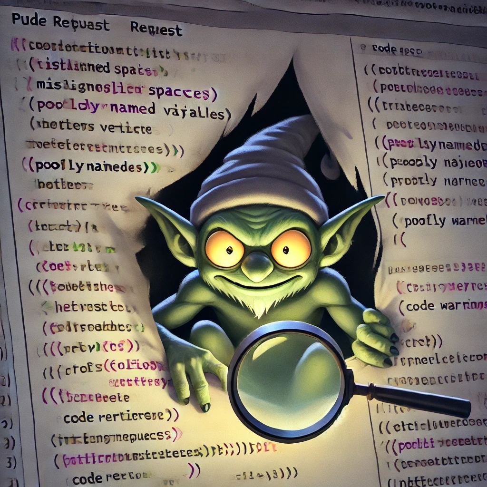

# The task
- To develop a CI tool that automatically checks the code quality of Java code in PR's, provide warnings for code style issues.
- The tool will be used as a preliminary code review, making it easier for reviewers to focus on more complex issues.

## Code Quality Analysis
- will be using `Checkstyle` for checking Java code against a set of coding standards and AI in Code Review

## How to test? 
To test the bot, follow these steps:
1. **Clone the repository**:
```bash
   git clone https://github.com/Larsters/Code-Goblin
   cd Code-Goblin
```
2. **Create a new branch**:
```bash
   git checkout -b test-branch
```
3. **Make changes to the code**:
- Modify the `sample.java` file to introduce some code style issues. For example, you can remove the space between the method name and the opening parenthesis and see how the bot reacts.

4. **Commit and push**:
```bash
git add Sample.java
git commit -m "Test code quality bot"
git push origin test-branch
```
5. **Create a pull request**:
- Go to Github repository
- Open a pull request from the `test-branch` branch to the `main` branch
6. **Check the feedback**:
The bot will automatically check the code quality of the Java code in the PR and provide warnings for code style issues. You can see the feedback in the PR comments.

